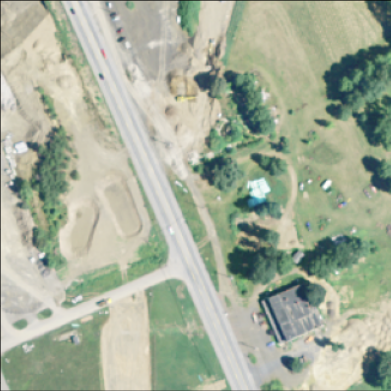

# Data Set
The Chesapeake Watershed data set is derived from satellite imagery over all of the US states that are part of the Chesapeake Bay watershed system. We are using the patches part of the data set. Each patch is a 256 x 256 image with 26 channels, in which each pixel corresponds to a 1m x 1m area of space. Some of these channels are visible light channels (RGB), while others encode surface reflectivity at different frequencies. In addition, each pixel is labeled as being one of:

    0 = no class
    1 = water
    2 = tree canopy / forest
    3 = low vegetation / field
    4 = barren land
    5 = impervious (other)
    6 = impervious (road) 

Here is an example of the RGB image of one patch and the corresponding pixel labels: 

 

Notes:
- [Detailed description of the data set](https://lila.science/datasets/chesapeakelandcover)

# The Problem
- Create an image-to-image translator that does semantic labeling of the images. 

# Solution
- An image translator model using keras is created to perform segmentation task.
- U-net type architecture is explored to perform pixel level classification.
- Sequential and Functional API's of Keras are used to build models.
- Confusion Matrix and accuracy plots are plotted for training, validation and test datasets.
- Multiple rotations(iterations) are run on super computer to assess model generalizability and avoid skewness in predictions.

* Visualizations and model results can be found in IPython Notebook [Visualizations](Visualization.ipynb)
* File where the actual execution starts is [here](hw8_base.py)
